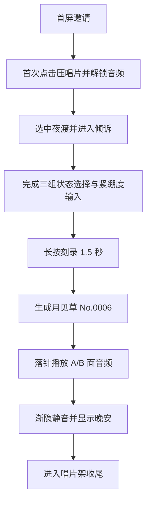

## 1. 产品概述
`声息花园` 是一个用于 90 秒视频走查的睡前声音陪伴 H5 Demo，以“压唱片 -> 选精灵 -> 倾诉 -> 刻录 -> 呈现 -> 落针播放 -> 种进花园”的单一路径完成一次情绪安放体验。
- 目标用户是夜间难以入睡、需要被温柔接住的学生与年轻用户。
- 产品价值在于用极简输入、柔软审美与可感知的“唱片生成”仪式，把抽象疲惫变成可观看、可聆听、可收藏的晚安载体。

## 2. 核心功能

### 2.1 功能模块
1. **首屏邀请**：展示世界观、四精灵围坐、唱片机与唯一入口按钮，完成首次音频解锁。
2. **选精灵**：展示四只精灵与小气泡介绍，默认高亮夜渡猫，并允许点击进入聊天。
3. **倾诉输入**：提供三组快节奏状态选项、紧绷度滑杆、自动匹配/自主输入视觉位，提交后进入刻录。
4. **长按刻录**：通过长按交互触发黑胶刻录、拍立得显影、萤火聚拢的核心仪式。
5. **唱片呈现**：展示固定结果“月见草 No.0006”、花语、编号与“落针播放”按钮。
6. **落针播放**：依据 A/B 面时间线控制主音乐、雨声、粉噪、环境暗化、呼吸圆与结尾“晚安”。
7. **唱片架收尾**：将 No.0006 种进花园，展示横排黑胶与结尾字幕。

### 2.2 页面明细
| 页面名称 | 模块名称 | 功能说明 |
|-----------|-----------|-----------|
| 首屏 | 标题与英文小标 | 细字、衬线、柔光、小号英文眉题，建立高级夜间氛围 |
| 首屏 | 唱片机与四精灵场景 | 黑胶、唱片机、音符、精灵均由代码绘制，精灵以 idle 动效围坐在场景中 |
| 首屏 | 压唱片按钮 | 玻璃质感按钮，首次点击后解锁全部后续音频播放权限 |
| 选精灵 | 精灵列表 | 四精灵横向或环绕排布，夜渡默认高亮，点击切换介绍气泡 |
| 选精灵 | 场景介绍气泡 | 每个精灵有一句短介绍，Demo 主路径固定进入夜渡聊天 |
| 倾诉 | 问答气泡 | 夜渡问候语与三问状态输入，用户通过单击选项完成投射 |
| 倾诉 | 紧绷度滑杆 | 0–100 范围滑杆，用于补充状态仪式感，不参与真实匹配 |
| 倾诉 | 光卡片 | 显示“自动匹配 / 自主输入”结果卡位，Demo 固定指向月见草 No.0006 |
| 按住刻录 | 长按按钮与进度 | 长按 1.5 秒以上触发刻录完成，期间显示环形或黑胶圈层进度 |
| 按住刻录 | 显影反馈 | 拍立得封面逐步清晰，萤火向中心聚拢，强化“生成”感 |
| 唱片呈现 | 封面与花语 | 固定展示月见草封面、标题、花语“没人看，也会开”、编号 No.0006 |
| 唱片呈现 | 操作入口 | 提供“落针播放”主入口与“查看侧记”次入口 |
| 落针播放 | 黑胶播放场 | 慢转黑胶、落地曲线、呼吸圆、A/B 面标识同步音频包络 |
| 落针播放 | 音量控制 | 提供主音量调节，不影响 Demo 自动播放流程 |
| 落针播放 | 结尾晚安 | 85–90 秒渐隐静音并浮现“晚安”，自动停止播放 |
| 唱片架 | 花园归档 | 将 No.0006 纳入连号黑胶横排，作为视频收尾镜头 |
| 唱片架 | 收尾字幕 | 展示“把说不清的疲惫，轻轻安放” |

## 3. 核心流程
本 Demo 只做黄金路径，不处理路径外分支、不做真实算法匹配、不做复杂表单校验。虽然简报标题写“6 屏”，但给出的流程表包含 7 个连续状态页；本项目以表格流程为准，将“唱片架”视为最终收尾页纳入主路径。

## 4. 用户界面设计
### 4.1 设计风格
- 主色为夜底 `#243A3D / #2A3B57`，辅以暖光 `#F1B968 / #E89A55 / #FBE6B0`、自然绿 `#88A982 / #A9C49C`、柔色 `#F4ECDB / #E7C7C2`、星点 `#FBF6E9`。
- 风格锚点对齐《光与夜之恋》的细字、衬线、英文小标、大留白、柔光细线，与《晚安森林》的角色融景、半透明文字面板、柔暖手绘感。
- 标题、侧记、花语使用 `Noto Serif SC`；正文 UI 使用 `Noto Sans SC`；标题必须有英文小标与柔和发光，不使用硬底框。
- 按钮统一为玻璃质感：半透明、模糊、细金边、呼吸辉光，不做实心糖果色填充。
- 动效统一采用 `cubic-bezier(.4,0,.2,1)`，时长 400–800ms；萤火双层极慢漂移；黑胶与唱片匀速慢转；呼吸圆约 6 次/分；转场为淡入淡出。

### 4.2 页面设计总览
| 页面名称 | 模块名称 | UI 要素 |
|-----------|-----------|-----------|
| 首屏 | 标题区 | 细字衬线主标题、英文眉题、暖金柔光晕、顶部大留白 |
| 首屏 | 中央场景 | 代码绘制唱片机、慢转黑胶、右上飘散音符、四精灵围坐、融入背景而非悬浮贴片 |
| 首屏 | 主按钮 | 玻璃按钮、细金边、发光呼吸、轻微按压反馈 |
| 选精灵 | 精灵陈列 | 四精灵呈轻弧形布局，中间留空，默认夜渡更亮且有光晕 |
| 选精灵 | 介绍气泡 | 半透明暖雾面板、细描边、短句文本，不做厚重卡片 |
| 倾诉 | 聊天气泡 | 夜渡对白采用柔雾对话框，问题与选项上下排布，留白充足 |
| 倾诉 | 状态输入区 | 选项按钮为轻玻璃胶囊，滑杆细线化，光卡片半透明悬浮 |
| 按住刻录 | 中央仪式区 | 中心长按锚点、圈层扩散、封面显影、萤火聚拢、背景整体压暗 |
| 唱片呈现 | 成果展示 | 发光封面、花语小字、编号、细线与留白排版，主次层级克制 |
| 落针播放 | 播放舞台 | 慢转黑胶、落地曲线、呼吸圆、A/B 屏标、背景渐暗过渡 |
| 唱片架 | 归档结尾 | 黑胶横排、花园式落点、极简字幕，留出视频收尾停顿 |

### 4.3 响应式策略
- 以移动端竖屏 H5 为第一优先，目标画布接近 `430 x 932`。
- 单页内使用绝对定位与分层蒙版保证视觉稳定，适配 `360px` 以上常见宽度。
- 所有交互均支持触屏，长按刻录优先保障移动端体验。

### 4.4 代码生成元素说明
- 黑胶圆盘、四精灵、唱片机、落地曲线、呼吸圆、音符、萤火均由 HTML/CSS/SVG/Canvas 绘制，不依赖额外素材。
- 背景图与封面图仅用于氛围底图和唱片封面，不将角色做成硬边贴图。
- 如缺失 `sfx_click.mp3 / sfx_reveal.mp3 / sfx_needle.mp3`，需在实现中提供静默兜底，避免 Demo 报错。

## 5. 内容与音频策略
- 三组状态输入固定为【情绪】【能量】【目标】与一条紧绷度滑杆，全部只服务于仪式感展示。
- Demo 不做真实匹配逻辑，输出固定为“月见草 No.0006”与花语“没人看，也会开”。
- 音频必须在用户首次点击“压唱片”后才可播放。
- 播放段时间线固定为：A 面 `0–35s` 音乐+雨+轻粉噪；过渡 `35–50s` 音乐淡出；B 面 `50–85s` 仅粉噪+雨并渐暗；`85–90s` 渐隐静音并显示“晚安”，随后自动停播。

## 6. 非目标与边界
- 不做路径外分支，不支持切换到其他精灵的独立聊天与独立音轨。
- 不做账号、存档、分享、真实推荐算法、后台接口。
- 不做多页路由，不引入框架，全部基于 `index.html + style.css + app.js` 单页显隐切换完成。
