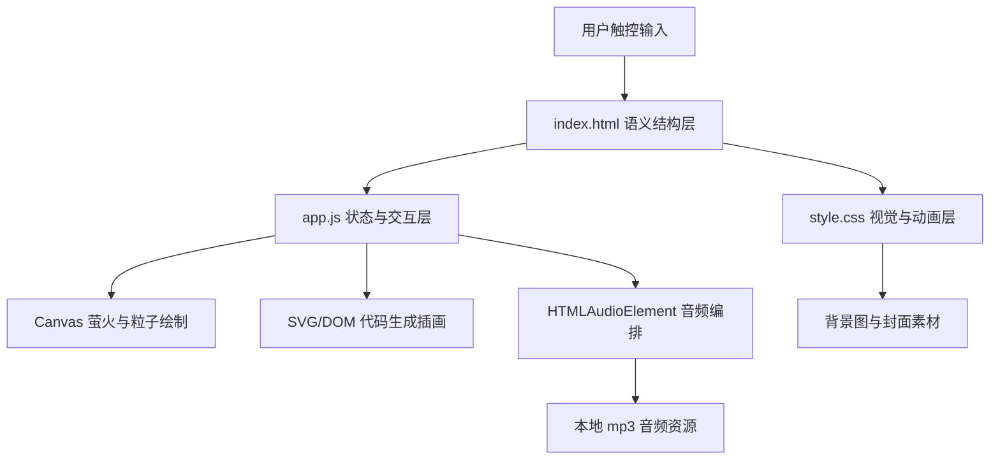

## 1. 架构设计
本项目采用纯前端静态架构，不使用框架、不接后端、不依赖数据库。所有页面状态、动画编排与音频时间线均由浏览器内原生 JavaScript 管理。



## 2. 技术说明
- 前端：原生 `HTML5 + CSS3 + JavaScript (ES2020)`
- 页面组织：单页 H5，使用多个 `section.screen` 作为连续状态页，通过类名显隐切换
- 视觉绘制：`SVG` 负责唱片机、黑胶、精灵、曲线；`Canvas` 负责萤火与粒子
- 音频控制：`HTMLAudioElement` 管理点击音效、语音、主音乐、雨声、粉噪与音量包络
- 资源管理：背景图、封面图、mp3 素材放置于 `assets/`
- 适配策略：移动端优先，限制最大舞台宽度，利用 `100dvh` 与安全留白控制镜头稳定

## 3. 文件职责定义
| 文件 | 作用 |
|------|------|
| `index.html` | 承载 7 个连续状态页的 DOM 结构、音频容器、可访问性语义标签 |
| `style.css` | 定义设计 Token、场景布局、玻璃按钮、转场、呼吸、渐暗、显影等视觉与动效 |
| `app.js` | 管理页面状态机、首次点击解锁音频、长按刻录、音频时间线、自动跳转与 UI 联动 |
| `assets/*` | 存放背景图、封面图与本地音频素材 |

## 4. 页面状态定义
| 状态标识 | 用途 | 进入方式 |
|-----------|------|-----------|
| `home` | 首屏邀请 | 默认进入 |
| `choose` | 选择精灵 | 点击“压唱片” |
| `chat` | 夜渡倾诉 | 选择夜渡 |
| `engrave` | 长按刻录 | 提交三组状态 |
| `reveal` | 唱片呈现 | 长按满 1.5 秒 |
| `playback` | 落针播放 | 点击“落针播放” |
| `shelf` | 唱片架收尾 | 播放结束自动进入 |

## 5. 关键模块设计

### 5.1 设计 Token
- 在 `:root` 中统一声明夜底、暖光、自然绿、柔色、星点、字体、缓动曲线、阴影强度与层级。
- 所有按钮、气泡、面板、发光元素均通过 Token 取值，避免局部样式跑偏。

### 5.2 屏幕切换状态机
- 使用 `currentScreen` 记录当前页，封装 `goTo(screenId)` 控制 `.screen.active` 的增删。
- 切换策略统一为淡入淡出，避免左右滑动造成信息密度过高。
- 黄金路径只保留单一成功分支，不实现返回、重选与异常状态。

### 5.3 音频解锁与回放控制
- 首次点击“压唱片”时调用统一解锁逻辑，初始化所有音频对象并执行一次静音播放尝试。
- 所有效果音与循环环境音由音频管理器集中控制，缺失文件时返回空对象并静默跳过。
- 播放页根据时间轴调整 `music / rain / pink noise` 三轨音量，并在结束时统一停止和复位。

### 5.4 长按刻录交互
- 监听 `pointerdown / pointerup / pointercancel / pointerleave` 实现跨触屏与鼠标的长按。
- 通过 `requestAnimationFrame` 或定时器更新刻录进度，满 1500ms 后锁定完成状态并切到呈现页。
- 长按期间驱动黑胶圈层、拍立得显影透明度、萤火聚拢半径同步变化。

### 5.5 播放页时间线
- `0–35s`：主音乐、雨声、粉噪同时播放，黑胶缓慢旋转，背景保持较亮夜景。
- `35–50s`：主音乐执行线性淡出，A 面过渡到 B 面，背景和字幕轻微压暗。
- `50–85s`：只保留雨声与粉噪，呼吸圆与落地曲线成为主要视觉节奏。
- `85–90s`：三轨统一淡出至静音，浮现“晚安”，结束后自动进入唱片架。

### 5.6 代码生成插画策略
- 精灵优先采用内联 SVG，便于做眼睛、尾巴、灯笼、浮动等局部动画。
- 黑胶、唱片机、呼吸圆、音符、落地曲线使用 CSS/SVG 组合绘制，保证统一风格与可调色。
- `Canvas` 仅负责萤火等高频粒子效果，避免用 DOM 堆积大量节点。

## 6. 路由与接口
本项目不使用 URL 路由，不存在后端 API。

| 标识 | 说明 |
|------|------|
| `#app` | 单页应用舞台根节点 |
| `.screen` | 每个可见状态页 |
| `window.SonicGrove` | 暴露极少量调试入口，例如 `goTo()` 与音频控制对象 |

## 7. 数据模型
本项目不建立持久化数据表，仅在内存中维护一次性 Demo 状态。

```js
const demoState = {
  screen: 'home',
  selectedElf: 'yedu',
  answers: {
    mood: '',
    energy: '',
    goal: '',
    tension: 50
  },
  record: {
    id: 'No.0006',
    title: '月见草',
    flowerWords: '没人看，也会开',
    cover: 'assets/cover_evening_primrose.png'
  },
  playback: {
    startedAt: 0,
    phase: 'idle',
    volume: 0.78
  }
};
```

## 8. 实现约束
- 保持纯 `HTML/CSS/JS` 单页，不引入任何框架或构建工具。
- 所有新增代码优先复用现有首屏实现，延续当前配色、SVG 精灵方式与萤火系统。
- 视觉层避免实心卡片和高对比按钮，所有面板应保持半透明、柔边、低饱和与留白。
- 缺失 `sfx_click / sfx_reveal / sfx_needle` 文件时不得抛错，需保留安全降级。
- 为 90 秒录屏服务，优先保证主路径稳定、镜头切换顺、音频能播、视觉节奏完整。

## 9. 验证方案
- 静态验证：检查 7 个状态页 DOM 是否都存在，设计 Token 是否集中在 `:root`。
- 交互验证：手动走通“压唱片 -> 选夜渡 -> 倾诉 -> 长按刻录 -> 落针播放 -> 晚安 -> 唱片架”。
- 音频验证：确认首次点击后才能播放，播放页能按时间线淡出并自动停播。
- 浏览器验证：启动本地静态服务，用浏览器截图检查首屏、刻录页、播放页与唱片架收尾镜头。
